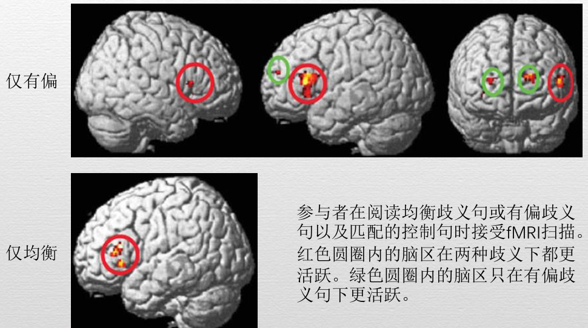
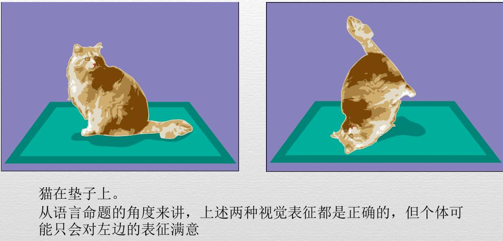

# 8 认知过程

- 认知是一个所有形式的“知”的通用术语
  - 内容：概念，事实，命题，规则和记忆
  - 过程：是指为了解释周围世界并为生活中的困境找到创造性解决办法，你如何操纵这些心智内容

- 解释心理过程
  - 唐德斯(F. C. Donders)的实验
    - 心理过程的速度：完成一项任务时，额外的心理步骤经常会使人们花更多的时间
    - 任务1：在所有的大写字符上画C
    - 任务2：在大写的元音字母上画V，在大写的辅音字母上画C
    - 任务3：在所有的大写字母上画V
  - 研究者经常利用**反应时**（参与者完成特定任务所花费的时间）来检验关于某种特定认知过程的一些解释
  - 序列过程：多个过程依次执行
  - 平行过程：多个过程同时执行
  - 理论家通过估计心理过程需要占用多少心理资源来确定心理过程是序列的还是平行的
    - 关键假设
      1. 人的加工资源有限并且必须分配给不同的心理任务
      1. 注意过程负责分配这些资源
  - 受控-自动维度
    - 受控过程：需要注意，一次执行一个以上的受控过程是困难的
    - 自动过程：一般不需要注意，常常能够无干扰地与其他任务同时执行
    - 充分练习：受控过程 >>> 自动过程
    - 任务变难：自动过程 >>> 受控过程
    - Ganor-Stern的实验
      - 圈出每对数字中字号更大的数字：List A比List B更困难（数值的大小会影响到对其字号大小的判断）
      - 
  
- 语言生成

  - 听众设计

    - 说话者在产生话语时，会考虑话语所针对的听众，以及与听众共享哪些知识
	
  - 赖格斯（Grice,1975）的合作原则
  
    - | 合作的说话者的四条格言                                       | 对说话者的价值                                               |
      | ------------------------------------------------------------ | ------------------------------------------------------------ |
      | 量：让你说的话提供的信息恰好满足需要，而不超出所需           | 必须尽力判断你的听众真正需要的信息有多少；评估听众可能已经知道什么 |
      | 质：尽量让你说的话真实。不要说你自己认为站不住脚的话。不要说缺乏证据的话。 | 当你说话时，听者会假设你能够用合适的证据支持你的断言。当你计划说每句话时，你都必须考虑这句话所基于的依据。 |
      | 关系：让你所说的话前后相关联                                 | 保证听者能够理解你正在说的如何与你以前所说的相关联。当转移话题时，必须做出解释。 |
      | 方式：显而易见。避免表达模糊和歧义。让你说的话简洁有序       | 以尽可能清晰的方式说话。尽管你会不可避免地犯错，但你必须保证你的听者能够理解你的信息 |
  
  
    - 克拉克（Clark,1996）：判断共同基础的三个根据
    
      - 团体成员身份
      - 行动同现：共同经历的某些事件或行动，包括双方稍早之前的交谈
      - 知觉同现：说话者与听者共同面对同一知觉事件
    
  - 言语执行和口误
  
    - **斯本内现象**（spoonerism）
  
      - 在一个短语或句子中两个或更多个词的首音互换
  
        - > You have tasted the whole worm
          >
          > You have wasted the whole term
  
      - 不是随机的
  
        - > “slips of the tongue”会被说成“tips of the tongue”，但不会被说成“tlips of the tongue”，因为“tl”不能作为起始声音
  
      - **SLIP技术**（实验室诱导产生的斯本内现象）：(darn bore)有时会被说成(barn door)
  
        1. 要求参与者默读一些由词对构成的词表，这些词对为希望出现的斯本内现象的声音结构提供了模型。例如 (ball doze) (bash door) (bean deck) (bell dark)
        2. 要求参与者大声说出像(darn bore)这样的词对
  
      - 当口误所产生的仍然是真实存在的词时，斯本内现象更可能出现
  
    - | 计划类型                                                     | 正确用法                                      | 口误                                          |
      | ------------------------------------------------------------ | --------------------------------------------- | --------------------------------------------- |
      | 选择最符合他们想法的内容词                                   | Grizzly和ghastly                              | grastly                                       |
      | 把所选的词放在话语中的正确位置。因为说话者在产生话语时会计划话语的整体单元，所以，内容词有时会发生错位。 | A tank of gas;Wine is being serverd at dinner | A gas of tank ;Dinner is being server at wine |
      | 必须说出想说的词。因为说话者要事先计划，所以有时会出现声音的错位。 | Left hemisphere Pass out                      | Heft lemisphere Pat ous                       |
  
  - 声音，词和结构的选择
  
    - 声音：特定的声音出现在特定位置的相对频率
    - 词：刚刚说过的单词会使与之有关联的单词更难被接着说出
    - 结构：最近听到的和理解的语言的句子结构会诱导产生与之结构相同的句子
    - 
  
- 语言理解

  - 歧义
    - 词语歧义
      - bank 既可以指银行也可以指河岸

    - 结构歧义（树形图分析法）
      - The mother of the boy and the girl will arrive soon.
      - 
      - 

  - 消解歧义
    - 语境的信息可以帮助个体消解词语歧义
      - 均衡歧义：To their surprise, the bark (树的外皮 或 犬吠声) wa unusual because it sounded high-pitched and hoarse.
      - 有偏歧义：Last year the pen (钢笔 或 动物的围栏) was abandoned because it was too dirty for the animals to live in.
      - 对于以上的的两种类型的歧义，大脑会以不同的方式做出反应
        - 

    - 语境的信息也可以帮助个体消解结构歧义

  - 理解的产物：命题
    - 语句的主要思想，是意义表征的基本单元
      - 

    - 如果一句话中的两个词属于同一个命题，那么即使它们在实际的句子中并不接近，在记忆中也会表征在一起
    - 我们通常能记得一句话的大致意思，但很难逐词记忆（语言加工过程执行的一个主要操作是抽取命题，而那些呈现命题的确切形式很快就会丢失）
    - 听者经常使用推论（inference）（根据记忆中的信息而做出的逻辑假设来填补空白）
      - 我要去熟食店见唐娜
      - 她答应买一块三明治给我当午餐
      - 推论1：她指唐娜
      - 推论2：熟食店是一个可以买到三明治的地方

    - 读者对文本的整个语境所形成的模型会影响他们的推论

- 语言的演化

  - **语言结构**
    - 人类语言的特殊之处在于，使用有限的单词表达无限的意义
    - 人类是唯一在生物学上有所准备的，能够学习如此复杂的语言规则的物种
      - 苏·萨维奇·朗博（Savage-Rumbaugh,1998）：倭黑猩猩可以通过观察其他生物（人类和倭黑猩猩）使用符号进行交流的过程来习得符号的意义，能理解一些英语口语，但是它们不能掌握可产生无数言语的语法规则

- 语言，思维和文化

  - 语言相对论：人们所使用的语言结构影响其思考世界的方式
    - 颜色词对颜色类别知觉的影响：纳米比亚的辛巴语不对蓝绿色调进行词义的区分，它使用一个词来表示大部分的蓝绿色调。辛巴人对于相应颜色的分类判断受到其语言的影响。

- 视觉认知

  - 

# 9 智力与智力测量

# 11 动机

# 12 情绪，压力与健康

# 13 理解人类人格

# 14 心理障碍

# 15 心理治疗

# 16 社会心理学

