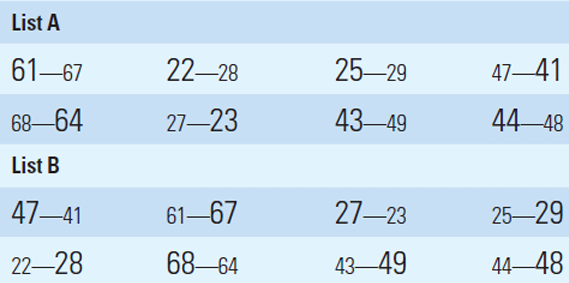

# 8 认知过程

- 认知是一个所有形式的“知”的通用术语
  - 内容：概念，事实，命题，规则和记忆
  - 过程：是指为了解释周围世界并为生活中的困境找到创造性解决办法，你如何操纵这些心智内容

- 解释心理过程
  - 唐德斯(F. C. Donders)的实验
    - 心理过程的速度：完成一项任务时，额外的心理步骤经常会使人们花更多的时间
    - 任务1：在所有的大写字符上画C
    - 任务2：在大写的元音字母上画V，在大写的辅音字母上画C
    - 任务3：在所有的大写字母上画V
  - 研究者经常利用**反应时**（参与者完成特定任务所花费的时间）来检验关于某种特定认知过程的一些解释
  - 序列过程：多个过程依次执行
  - 平行过程：多个过程同时执行
  - 理论家通过估计心理过程需要占用多少心理资源来确定心理过程是序列的还是平行的
    - 关键假设
      1. 人的加工资源有限并且必须分配给不同的心理任务
      1. 注意过程负责分配这些资源
  - 受控-自动维度
    - 受控过程：需要注意，一次执行一个以上的受控过程是困难的
    - 自动过程：一般不需要注意，常常能够无干扰地与其他任务同时执行
    - 充分练习：受控过程 >>> 自动过程
    - 任务变难：自动过程 >>> 受控过程
    - Ganor-Stern的实验
      - 圈出每对数字中字号更大的数字：List A比List B更困难（数值的大小会影响到对其字号大小的判断）
      - 
  
- 语言生成

  - 听众设计

    - 说话者在产生话语时，会考虑话语所针对的听众，以及与听众共享哪些知识

    - 赖格斯（Grice,1975）的合作原则

  	  - | 合作的说话者的四条格言                                       | 对说话者的价值                                               |
      | ------------------------------------------------------------ | ------------------------------------------------------------ |
      | 量：让你说的话提供的信息恰好满足需要，而不超出所需           | 必须尽力判断你的听众真正需要的信息有多少；评估听众可能已经知道什么 |
      | 质：尽量让你说的话真实。不要说你自己认为站不住脚的话。不要说缺乏证据的话。 | 当你说话时，听者会假设你能够用合适的证据支持你的断言。当你计划说每句话时，你都必须考虑这句话所基于的依据。 |
      | 关系：让你所说的话前后相关联                                 | 保证听者能够理解你正在说的如何与你以前所说的相关联。当转移话题时，必须做出解释。 |
      | 方式：显而易见。避免表达模糊和歧义。让你说的话简洁有序       | 以尽可能清晰的方式说话。尽管你会不可避免地犯错，但你必须保证你的听者能够理解你的信息 |

    - 克拉克（Clark,1996）：判断共同基础的三个根据
    
      - 团体成员身份
      - 行动同现：共同经历的某些事件或行动，包括双方稍早之前的交谈
      - 知觉同现：说话者与听者共同面对同一知觉事件
    
  - 言语执行和口误

# 9 智力与智力测量

# 11 动机

# 12 情绪，压力与健康

# 13 理解人类人格

# 14 心理障碍

# 15 心理治疗

# 16 社会心理学

