# 普通心理学

## 第一章 生活中的心理学

### 心理学为独具特色

心理学：关于**个体**的**行为**及**心理**过程（心智过程）的**科学**研究

科学方法：由一套用来分析和解决问题的有序步骤组成，用客观收集到的信息作为得出结论的事实基础

行为：人和其他动物的可观察行为

心理过程（心智）：发生在个体内部的过程——思考、计划、归因、创造以及做梦

- 心理学的目标：

  - 描述发生的事情

    - 行为数据：关于有机体的行为以及行为发生条件的观察报告
    - 整合不同分析水平提供的信息
      - 复杂社会环境和文化环境中作为整体的人的行为（暴力、偏见的根源）
      - 狭窄和精细的行为单元（对交通灯的反应速度）
      - 更小的行为单元——生物基础（大脑中存储不同记忆类型的部位）
    - 保证客观性
      - 排除主观观点——偏差、偏见和期望——的影响

  - 解释发生的事情

    - 大多数行为受到内部因素和外部因素的共同影响

      > 解释一些人为什么开始吸烟？

      - 内部解释：个体的冒险倾向
      - 外部解释：大量的同辈压力
      - 综合解释：上述二者都是必不可少的

    - 通过一个潜在的原因解释多种行为（通常的目标）

    - 见多识广的想象力

      - 把已知和未知的事物创造性地整合起来

  - 预测将要发生的事情

    - 科学预测的措辞必须足够精确，以便能对其进行检验，若证据不支持就予以拒绝
    - 对于某些行为方式背后原因的准确解释，常常能让研究者对未来的行为做出准确的预测

  - 控制发生的事情

    - 控制意味着使行为发生或不发生——启动行为，维持行为，停止行为，以及影响行为的形式、强度或发生率
    - 如果我们根据一个对行为的因果解释能够创造出行为得以被控制的条件，那么这个因果解释就是令人信服的
    - 帮助人们提升生活质量的途径
    
### 现代心理学的发展

> 心理学史、结构主义、机能主义、作为先驱者的女性、
>
> - 柏拉图与亚里士多德的哲学思想之争 
>   - 亚里士多德、约翰∙洛克：经验主义者 
>     -  人们的心智生来是白板，通过在世界上的经验来获取信息 
>   - 柏拉图、伊曼努尔∙ 康德：先天论者 
>     - 人们生来便具有心理结构，对人们经验世界的方式产生了限制
>
> - 实验心理学实验室的建立 
>   - 威廉∙冯特：建立了第一个正式的实验心理学实验室 
>   -  爱德华∙铁钦纳：美国第一批心理学家之一 
>   - 威廉∙詹姆士：《心理学原理》
>   - 斯坦利∙霍尔：美国心理学协会
>
> - 结构主义
>   - 对心理和行为的结构的研究
>   - 铁钦纳：内省法
>   - 存在的问题：简化论、元素论
>   - 马克思∙惠特海默：格式塔心理学
>
> - 机能主义
>
>   - 行为的机能或目的是什么
>
>   - 约翰∙杜威：美国教育领域的改革
>
> 
>
> - 玛丽∙惠顿∙卡尔金斯 
>   - 美国心理学协会的第一位女主席 
>   - 创造了研究记忆的重要技术 
> - 玛格丽特∙沃什布恩 
>   - 第一位获得心理学博士学位的女性
>   - 《动物心理》 
> - 海伦∙汤普森∙伍利 
>   - 智力和情绪测验的性别差异研究
> - 丽塔∙斯塔特∙霍林沃斯 
>   -  智力的性别差异研究 
>   - 智力极端儿童的研究

- 心理学的观点

| 观点       | 研究的焦点             | 基本研究主题                               |
| ---------- | ---------------------- | ------------------------------------------ |
| 心理动力学 | 无意识驱力、冲突       | 作为无意识动机外显表达的行为               |
| 行为主义   | 特定的外显反应         | 行为及其刺激的原因和结果                   |
| 人本主义   | 人类的经验和潜能       | 生活模式、价值观、目标                     |
| 认知       | 心理过程、语言         | 通过行为指标推断心理过程                   |
| 生物学     | 脑与神经系统的加工过程 | 行为和心理加工过程的生物化学基础           |
| 进化       | 进化而来的心理适应性   | 从进化而来的适应性功能的角度来阐述心理机制 |
| 社会文化   | 态度和行为的跨文化模式 | 人类经验的普遍性方面和文化特异性方面       |

- 心理动力学观点
  - 人类的行为源于遗传的本能、生物驱力，以及为解决个人需要与社会要求之间的冲突而做的努力
  - 剥夺状态、生理唤起和冲突都为行为提供了力量
  - 西格蒙德∙弗洛伊德：行为有可能是由意识觉知之外的动机驱动的；强调儿童早期是人格形成的阶段
- 行为主义观点
  - 试图理解特定的环境刺激如何控制特定类型的行为
  - 强调严格的实验和严谨定义的变量
  - 约翰·华生、B.F.斯金纳
- 人本主义观点具体
  - 人是具有能动性的生物，本性善良而且具有选择能力，人类的主要任务是争取积极的发展
  - 卡尔·罗杰斯：积极关注
  - 亚伯拉罕·马斯洛：自我实现
- 认知观点
  - 关注人的思维以及所有的认识过程——注意、思考、记忆和理解，一些最重要的行为是从全新的思维方式中产生的
  - 在认知视角下，个体不是对客观的物质世界做出反应，而是对个体思维和想象的内在世界的主观现实作出反应。
  - 诺姆∙乔姆斯基：儿童语法的获得 
  -  让∙皮亚杰：儿童的认知发展理论
- 生物学观点
  - 在基因、大脑、神经系统以及内分泌系统的机能中寻找行为的原因
  - 行为取决于生理结构和遗传过程，经验可以通过改变基础的生物结构和过程来改变行为。
  - 行为神经科学：试图理解诸如感觉、学习、情绪等行为背后的大脑过程
  - 认知神经科学：关注高级认知功能的脑机制，比如记忆和语言
- 进化观点
  - 心理能力和身体能力一样，经过了几百万年的进化以达成特定的适应性目标
  - 适应性问题：躲避食肉动物和寄生虫、采集和交换食物、寻找并留住配偶以及抚育健康的子女
  - 男性和女性所承担的不同性别角色
- 社会文化观点
  - 研究行为的原因和结果的跨文化差异（弗洛伊德的心理动力学理论中的很多方面都不能应用到与弗洛伊德时代的维也纳几位不同的其他文化中）

### 心理学家做些什么

> 心理学家们做些什么、学位分布，工作场所
>
> - 认知心理学家 
>   - 基本的认知过程，如记忆和语言  
> - 社会心理学家 
>   - 塑造人们态度和行为的社会力量
> - 工业与组织心理学家
>   - 提升工作场所中人们的调适能力 
> - 教育心理学家
>   - 教育环境下学生的调适能力
> -  临床心理学家
>   - 应用心理学知识来改善人们的生活

## 第二章 心理学的研究方法

### 研究过程

1. 初始的观察或问题
2. 形成假设
3. 设计研究
4. 分析数据并得出结论
5. 报告研究发现
   1. 所有的数据和方法都必须接受公开检验
   2. 同行评审
   3. 向更广泛的公众传播科研结果
6. 考虑开放的问腿
7. 对开放的问题开展研究

理论：一套用于解释一种现象或一系列现象的有组织的概念集合。

决定论假设：一切事件，包括生理的、心理的和行为的，都是特定原因的结果，或者是由其所决定的。

假设：对原因和结果关系的试探性的、可以检验的阐述。

科学方法：一套以能够限制误差源并得出可靠结论的方式收集和解释证据的一般程序。

观察者偏差：由观察者个人的动机和预期导致的错误。（观察者偏差起着过滤器的作用，一些事情被视为是相关的和重要的而获得注意，另一些则被视为无关和不重要的而被忽略）

标准化：在数据收集的所有阶段均使用统一的、一致的程序。

操作性定义：以测量该概念或决定它是否存在的特定操作或程序来界定一个概念从而在实验内使其含义标准化。（一个实验中的所有变量都必须给予操作性定义）

- 变量：任何在数量或性质上可以有不同取值的因素。
  - 自变量：被操纵的变量
  - 因变量：实验者所测量的变量

- 实验法
  - 研究者操纵一个自变量来观察其对因变量的影响
  - 优势：允许实验者得出关于变量间因果关系的判断
  - 劣势：人为控制的实验环境本身可能歪曲原本可自然发生的行为；参与者在知道被监控的情况下可能试图取悦研究者、尝试揣测研究的目的；有一些重要的问题受到伦理的约束而不可能实施

混淆变量：并非实验者有意引入到实验情境中的一些因素确实影响了参与者的行为，并混淆了数据的解释。

期望效应：研究者或观察者以微妙的方式向参与者传达他所预期发现的行为，并因此引发期望的反应。

安慰剂效应：因个体相信治疗有效而导致的健康或幸福感的改善。（当没有施加任何一种实验操纵，但实验者却改变了他们的行为。）

控制程序：一些试图使所有变量和条件（除了那些与被验证的假设相关的）保持恒定的方法

双盲控制：实验助手和参与者都不知道哪些参与者接受了何种处理

安慰剂控制：引入一个不进行任何处理的实验条件

- 研究设计
  - 被试间设计：参与者被随机分配到实验条件和控制条件
  - 代表性样本：在性别、种族等方面的分布都与总体的特征非常吻合的样本
  - 随机取样：总体的每个成员参与实验的可能性都是相等的
  - 被试内设计：利用每一个参与者作为自己的控制组

相关法：用于确定两个变量、特质或者属性之间的关联程度（相关不意味着因果关系）

### 心理测量

信度：心理测验或实验研究得到的行为数据的一致性和可靠性（可重复性）

效度：研究或测验得到的信息准确地测量了研究者想要测量的心理变量或品质（预测性）

- 自我报告法：通过言语（手写或口述）回答研究者提出的问题。
  - 获得无法直接观察到的经验的数据（包括内部的心理状态和外部行为）
  - 问卷法和访谈法
  - 局限性
    - 不适用于语言能力受限的参与者
    - 参与者可能错误理解问题或不能清楚地记得过去的经历
    - 受到社会期望的影响
    - 参与者可能说谎或捏造事实
    - 访谈的情境会产生个人偏见和成见

行为测量：研究外显行为和可观察、可记录的反应的方法

- 观察
  - 直接观察：清晰可见的、外显的、容易记录的行为（面部表情）
  - 技术辅助的间接观察（计算机：反应时，脑成像技术：大脑的活动）
  - 自然观察：研究者观察一些自然发生的行为而不试图改变或干涉它

许多研究结合使用自我报告法和行为观察法

个案研究：集中在个体或小群体上进行各种测量（有时对特殊个体进行透彻分析有助于理解人类经验的普遍特性）

### 人类和动物研究中的伦理问题

- 知情同意（签署同意书）
  - 告知将要经历的程序以及参与研究的潜在风险和利益
  - 确保参与者的隐私得到保护
  - 提前告知参与者可以在任何时间停止实验，没有任何处罚
- 风险/收益的评估
  - 把风险降至最低程度
  - 把风险告知参与者
  - 采取适当的防范措施应对可能的强烈反应
- 故意欺骗（不让参与者事先知道研究的目的）
  - 研究必须具有充分的科学价值和教育价值
  - 如果研究有很高的可能性导致参与者身体疼痛或严重的情绪痛苦，那么研究者一定不能欺骗参与者
  - 必须证明除了欺骗之外，没有任何同等有效的替代研究程序
  - 研究者必须在研究结束后，对参与者解释实验中欺骗
  - 参与者在欺骗得到解释后，必须有机会收回自己的数据

事后解释：尽可能多地提供有关该研究的信息，确保参与者离开时没有疑惑、心烦或尴尬。

- 动物实验
  - 获益
    - 可以进行一些非常重要的突破性研究，如药物成瘾等
    - 有利于动物本身，如更好的治疗方法等
  - 3R原则：
    - 减少所需的动物数量（reduce）
    - 替换动物的使用（replace)
    - 改善实验步骤以使疼痛和不适降至最小（refine)

### 成为有批判精神的研究消费者

- 避免把相关推论为因果。
- 要求关键术语和概念有操作性定义，这样人们才能对其含义有一致的理解。
- 在寻找证实性数据之前，首先要考虑如何反驳一个理论、假设或信念，因为只要你想证明它们合理，证据总能很容易找到。
- 不要轻信显而易见的解释，要不断寻找其他可能的解释，尤其在已有的解释会给提出者带来利益之时。
- 要认识到个人偏差会怎样歪曲对现实的感知。
- 要对复杂问题的简单答案以及复杂效应和问题的单一原因和解决方案保持怀疑。
- 对所有宣称有效的治疗、干预或产品保持质疑，找出其效果的对照基础：与什么相比？
- 心智开放，保持怀疑态度 ：必须意识到，大多数结论是初步的而非确定的；寻找新证据以减少你的不确定感，同时对变化和修正保持开放态度。
- 挑战那些在做结论时使用个人观点取代证据且不接受建设性批评的权威。

### 理解统计学：分析数据并得出结论

描述统计：以一种客观的、统一的方式使用数学程序来描述数值型数据的不同方面

推论统计：利用概率论来确定一组数据完全因随机变异而出现的可能性

- 集中量数：可作为一组参与者最典型分数指标的单个代表性分数
  - 中数
  - 众数
  - 平均数
- 差异量数：描述围绕在集中量数周围的分数分布情况的统计量
  - 全距（极差）
  - 标准差
  - 方差
- 相关
  - 相关系数：关于两个变量之间相关程度和性质的度量
  - 绝对值反应相关性大小，正负反应相关性方向
- 正态曲线 
  - 当从大量个体身上收集关于某个变量的数据时，数据的分布常常符合正态曲线 
  - 完全由随机因素造成的差异也符合正态曲线
- 统计显著性
  - 当差异由随机所致的概率不足5%时，（以p<0.05来表示），心理学家将接受这个差异为“真”。
  - 检验方法的选择取决于研究设计、数据类型以及样本的大小
  - t检验：考察两组数据的均值差异是否达到统计上的显著性
- 成为一个明智的统计学消费者
  -  参与者群体的选择会对结果造成很大的影响 
  - 当数据不能满足统计学的基本假设时（如有极端值）， 统计分析会得出一些误导结果
    - 检查样本的大小 
    - 同时检查中数、众数以及平均数
  - 研究应当报告样本大小、变异量数以及显著性水平

## 第三章 行为的生物学和进化基础

### 遗传和行为

心理学研究的主要目标之一是发现各种人类行为产生的原因。

天性和教养，或者说遗传与环境，是心理学对因果解释的一个重要维度。

物种的多样性反映了自然选择的作用。

基因型：个体的全部基因组合（基因结构）

表型：个体的外表和行为模式

环境压力（环境的变化）->竞争（为了获得资源）->最适表型得到选择（从各种表型之中）->繁殖成功（最适表型相应的基因型传递给下一代）->基因型（和表型）的频率增加（在下一代中）

两足化和大脑化是人类的两大适应性进化

两足化：直立行走的能力

直立行走使得人类的祖先可以探索新资源和开发新环境。

大脑化：脑容量的增大，发展出复杂的思考、推理、记忆和计划能力

语言的出现是人类进化的下一个里程碑，也是文化进化的基础

遗传：从祖先那里对生理和心理特质的继承（研究遗传机制的学科：遗传学）

遗传的基本单元是基因，基因与环境之间存在交互作用，共同影响表型特征。

>  遗传力：亲代性状传递给后代的能力大小

基因组：一个有机体的基因组是指染色体上基因以及相关DNA的全部序列。

> 人类行为遗传学：结合遗传学和心理学来探究遗传和行为之间的因果联系，==关注个体差异的来源==（关注于估计特定人类性状或行为的遗传力 (heritability)）

研究方法：收养研究；双生子研究

- 比较同卵双生子和异卵双生子在特定特质或行为上的相似性（食物偏好的遗传力）

### 神经系统的活动

神经元是神经系统的基本单元，接受、加工和传递信息到其他细胞、腺体和肌肉‘

- 神经元的结构
  - 树突：接受从感受器或其他神经元发出的刺激
  - 胞体：维持细胞的生命，整合从树突接收的刺激
  - 轴突：向外延展的纤维，将整合后的信息传递出去
  - 终扣：轴突末端膨大的球状结构

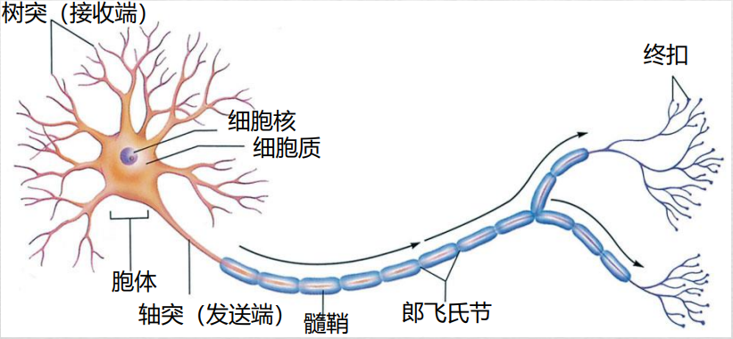

感觉神经元：携带来自感受器细胞的信息向内传至中枢神经系统

感受器：高度特化的细胞，对光线、声音或身体姿势等非常敏感

运动神经元：携带来自中枢神经系统的信息向外传至肌肉和腺体

中间神经元：（大脑中的绝大多数）将来自感觉神经元的信息，再传递到其他中间神经元或运动神经元

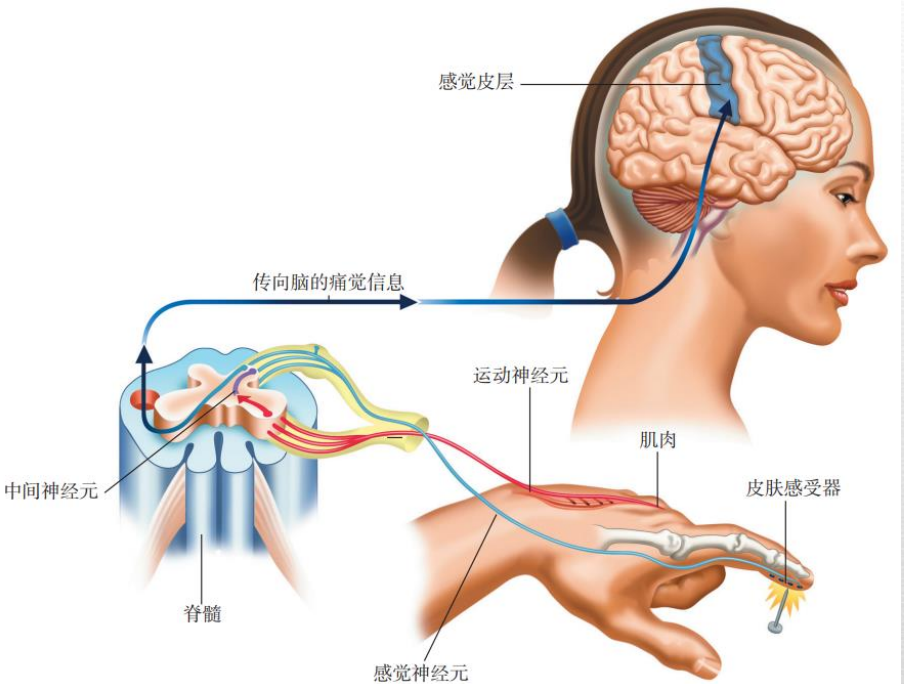

镜像神经元：观察其他个体执行动作时模拟相同动作以理解其行为意图

- 胶质细胞

  - 固定神经元的位置

  - 帮助新生的神经元找到其在脑中的适当位置（发育过程中）
  - 清理脑内环境，清除受损或死亡的神经元留下的废物；吸收过量的神经递质和神经元间隙的其他物质
  - 绝缘作用，形成髓鞘增加神经信号的传导速度
  - 被称为星形胶质细胞的特化胶质细胞构成血脑屏障阻碍有毒有害物质（非脂溶性物质）

静息电位：细胞内液相对细胞外液具有70mv的负电压的极化电位

动作电位：

 1. 在静息状态下，轴突周围液体的离子浓度不同于轴突内部的液体。正因如此，细胞内液发生相对细胞外液的极化，产生神经元的静息电位。

 2. 当神经冲动到达轴突的一个节段时，带正电的钠离子流入轴突。钠离子的内流导致神经元变成去极化。随着每个阶段依次变成去极化，神经冲动沿着轴突向下传递。（离子通道）

    1. > 兴奋性输入引起离子通道允许钠离子流入细胞=》导致细胞发放
       >
       > 抑制性输入引起离子通道努力保持细胞内呈现负电位=》阻止细胞发放

 3. 一旦神经冲动传过，钠离子流出轴突，则静息电位得以恢复。（泵出）

 4. 一旦恢复静息电位，轴突的这个节段就准备好了传递下一个冲动。

全或无定律：阈值以上，动作电位的大小不受刺激强度增加的影响；一旦兴奋性输入的总和达到阈值，统一大小的动作电位便会产生；如果未达到阈值水平，动作电位就不会产生。

- 不应期
  - 绝对不应期：无法引发动作电位
  - 相对不应期：只对比平常发放所需强度更加强烈的刺激作出反应

在轴突覆盖髓鞘的神经元上，动作电位从一个节点向下一个节点跳跃式传导。(节省时间；节省在轴突各个位置的离子通道开闭所需的能量)

> 多发性硬化症：由于髓鞘退化而引起的严重障碍。症状：复视、震颤，最终导致瘫痪。来自身体免疫系统的特化细胞侵害了有髓鞘的神经元，使轴突裸露出来破坏了正常的突触传递。

- 突触
  - 突触前膜：发出信息神经元的终扣
  - 突触后膜：接收信息神经元的树突和胞体的表面 

神经递质与镶嵌在突触后膜上的受体分组结合的条件：不能有其他神经递质或化学分子附着在受体分子上；神经递质的形状必须与受体分子相匹配

去处：被突触前终扣重新吸收；在酶的作用下分解

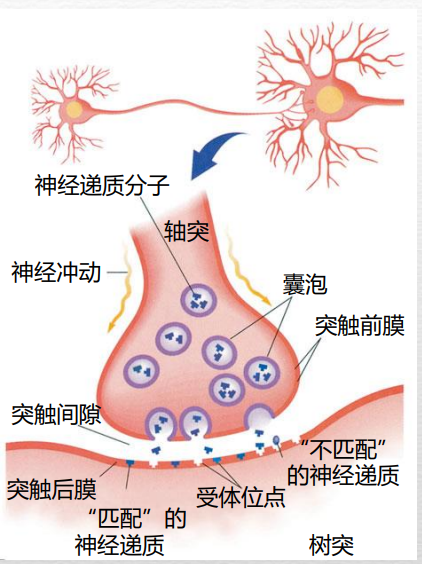

- 乙酰胆碱：兴奋性神经递质，引起肌肉收缩，存在于中枢和外周神经系统
  - 关联：阿尔兹海默症（记忆丧失，分泌乙酰胆碱的神经元退化）

- $\gamma$-氨基丁酸 （GABA）：脑中最普遍的抑制性神经递质，可能多达1/3的脑部突触使用~作为作为信使，对其敏感的神经元特别集中于丘脑、下丘脑和枕叶皮层等脑结构中
  - 关联：焦虑或抑郁=》苯二氮䓬类药物可提高GABA的活性（帮助与突触后分子结合）

- 谷氨酸：脑中最普遍的兴奋性神经递质（因为有助于在脑中传递信息，所以它在情绪反应，学习和记忆过程中起着关键作用）
  - 关联：谷氨酸受体不能正常工作时，学习的进程会变慢；谷氨酸水平的紊乱与多种心理障碍有关，包括精神分裂症；在药物，酒精和尼古丁成瘾中起作用

- 多巴胺、去甲肾上腺素（儿茶酚胺类）、5-羟色胺
  - 多巴胺和去甲肾上腺素在心理障碍中起到重要作用，如焦虑障碍、心境障碍和精神分裂症。
  - 增加脑内去甲肾上腺素水平的药物可以提升心境和减轻抑郁，精神分裂症的病人脑中多巴胺高于正常水平（降低多巴胺水平以治疗）
  - 所有产生5-羟色胺的神经元都位于脑干，这一结构与唤醒以及许多自主过程有关（致幻剂LSD似乎通过抑制5-羟色胺神经元而产生效应，正常情况下它们会抑制其他神经元）

- 内啡肽：神经调质：能够改变或调节突触后神经元活动的物质
  - 内源性吗啡的简称，在情绪行为（焦虑，恐惧，紧张和愉悦）和疼痛的控制具有重要作用
  - 纳洛酮可以阻断吗啡和内啡肽与受体的结合（检验内啡肽在针灸和安慰剂的镇痛效应中至少有部分作用的可能性）

### 生物学和行为

对脑的干预

- 损伤：
  - 盖奇：脑损伤，心理变化
  - 布洛卡区：语言障碍
  - 动物损伤实验（控制脑损伤的部位和程度）
- 重复经颅刺激（rTMS）：使用磁刺脉冲来对人类参与者造成暂时的可逆损伤，而不需要对实际组织造成损害就可以干预特定脑区的活动的程序
- 直接刺激脑区：沃尔特·赫斯

大脑活动的记录和成像

- 脑电图（EEG）：在头皮上放置电极，记录大范围整合性的电活动模式
- 计算机断层扫描术（CT|CAT）
- 正电子发射断层扫描术（PET）
- 磁共振成像（MRI）
- 功能性磁共振成像（fMRI）

神经系统

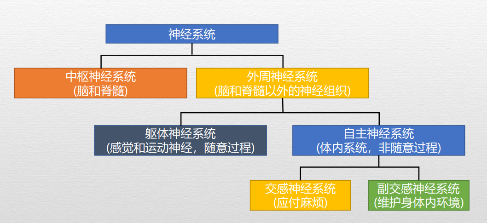

中枢神经系统（CNS）由脑和脊髓中的所有神经元组成，外周神经系统（PNS)由所有构成神经纤维的神经元构成，这些神经纤维把CNS和身体联系起来。

中枢神经系统的工作是整合和协调所有的身体功能，加工全部传入的神经信息，向身体的不同部位发出指令。

PNS把来自感受器的信息提供给CNS，并传递脑对身体器官和肌肉的指令。

- 脊髓
  - 中枢神经系统发出和接收神经信息是通过脊髓而实现的。
  - 脊髓是将脑与外周神经系统联系起来的神经元干线，它位于脊柱的椎管内。
  - 脊神经从脊柱的每对椎骨之间的脊髓发出，最终遍及全身的各种感受器，肌肉和腺体联系起来。
  - 脊髓协调身体两侧的活动，并负责不需脑参与的简单且动作迅速的反射。
  - 脊髓的神经受损会导致腿部或躯干的瘫痪，瘫痪的范围取决于脊髓受损部位的高度，损伤的部位越高，造成的瘫痪范围越大。

- 躯体神经系统（SNS）：调节骨骼肌的动作
- 自主神经系统（ANS）：维持机体的基本生命过程，应对两种状态
  - 机体受到威胁：交感神经=》逃跑或战斗反应
  - 维持常规身体状态：副交感神经=》常规维护

交感神经系统的神经纤维从脊髓发出或传入脊髓的途中，会连接到神经节，即特化的神经链簇。

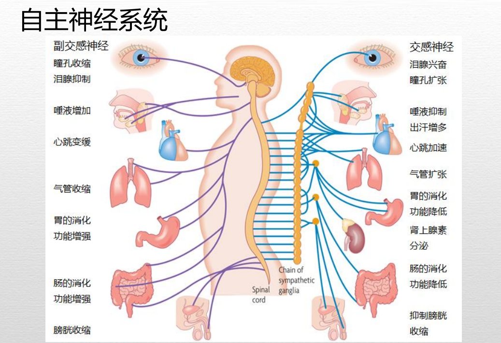

脑干：主要与自主过程如心率、呼吸、吞咽和消化等功能有关。

边缘系统：与动机、情绪和记忆过程有关。

大脑皮层：全部的心理过程发生的场所，整合感觉信息，协调你的运动，促成抽象思维和推理。

- 脑干、丘脑和小脑
  - 脑干：综合调节机体内部状态的脑结构
  - 延髓：位于脊髓的最上端，是呼吸、血压和心跳调节中枢（延髓的损伤是致命的），从身体发出的上行神经纤维和从脑发出的下行神经纤维都在延髓发生交叉（解释了为何身体左侧与大脑右侧相连，etc.）
  - 脑桥：紧贴延髓之上，提供传入纤维到其他脑干结构和小脑中。
  - 网状结构：一类致密的神经细胞网络，（脑的哨兵）唤醒大脑皮层去注意新刺激，甚至在睡眠中也保持脑的警觉反应（该区域的大面积损伤会导致昏迷），其有伸向丘脑的长纤维束，传入的感觉信息通过丘脑到达大脑皮层的适当区域，并在那里进行进一步的加工。
  - 小脑：与脑干相连，位于头骨基底部，协调身体的运动，控制姿势并维持平衡。（更多的功能：学习和执行身体运动序列，还可能与一些高级的认知功能有关，如语言加工和痛觉体验）
- 边缘系统：与动机行为、情绪状态和记忆过程相关。它也参与体温、血压和血糖水平的调节，并执行其他体内环境的调节活动。
  - 海马：边缘系统中最大的脑结构，在记忆获得中发挥重要作用（H.M.）
  - 杏仁核：在情绪控制中起作用（损伤对于精神活跃的个体产生镇静效应）（损害对于特定面部表情的识别：带有悲伤和恐惧等负性情绪）在带有情绪内容的记忆的形成和提取中发挥重要作用
  - 下丘脑：脑内最小的结构之一，由几个神经核团组成，级调节与动机行为（包括进食）饮水、体温调节和性唤起）有关的生理过程和小神经元束；下丘脑维持着身体内稳态。

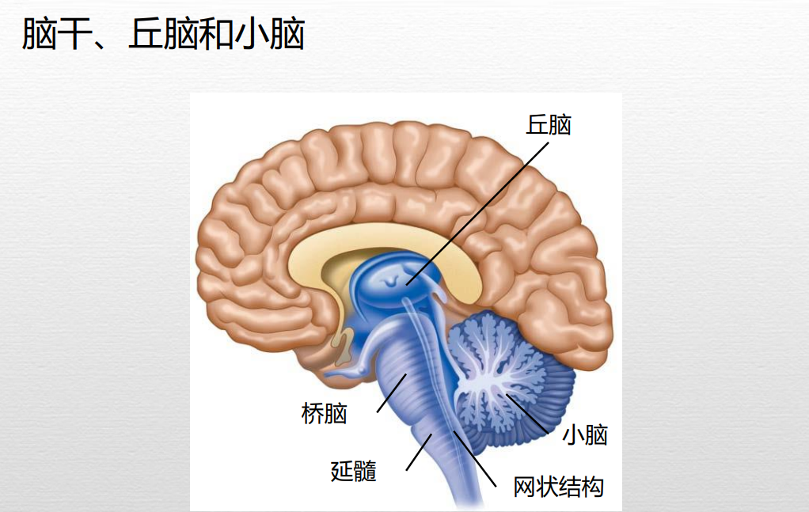

- 大脑：大脑分成左右对称的两半，称为大脑半球；两个半球被大量神经纤维连接起来，这些纤维总称为胼胝体，这个通路负责在两个半球之间来回传递信息。
  - 额叶：参与运动控制和认知活动，如计划、决策、设定目标，位于外侧裂之上和中央沟之前（盖奇，布洛卡区，损伤会对人的行为和人格产生毁灭性影响）
  - 顶叶：负责触觉、痛觉和温度觉，位于中央沟之后
  - 枕叶：视觉信息到达的部位，位于头的后部
  - 颞叶：负责听觉过程，位于外侧裂下部，即每个大脑半球的侧面（包括维尔尼克区：生成的言语流畅无意义，言语的理解能力受到了损害）
  - 每个脑结构合作完成它们的功能，但是有的功能有必须的区域，当这些区域受损时，它们的功能就遭到破坏或完全丧失。
  - 额叶运动皮层：身体的随意肌有600余块，其活动受到正好位于中央沟之前的额叶运动皮层的控制
    - 脑一侧发出的命令传向身体对侧的肌肉，身体下部的肌肉受到运动皮层顶部神经元的控制，身体上部的肌肉受运动皮层下部神经元的控制
    - 与身体下部相比，身体上部从皮层得到精细得多的运动指令
    - 运动皮层的两个最大区域负责支配手指（尤其是大拇指）以及言语相关的肌肉活动（反映了操作物体、使用工具、进食和谈话等这些人类活动的重要性）
  - 躯体感觉皮层：加工温度、触觉、躯体位置和疼痛的信息
    - 感觉皮层的上部与身体下部相关，皮层下部与身体上部相关
    - 感觉皮层的大部分区域用于加工来自唇、舌、拇指和食指的感觉信息
    - 听觉信息由听皮层加工，位于两侧颞叶
    - 视觉传入由位于大脑后部枕叶的视皮层进行加工（视皮层的最大区域接受眼后部视网膜中心区的传入信息，这里传递的视觉信息最为详细）
  - 联络皮层：将不同感觉通道的信息结合起来，用于计划对外界刺激做出适当反应

半球功能偏侧化：某些功能会偏侧化到一侧大脑半球（大多数个体的言语功能位于左半球）

裂脑病人研究（实验内容和结论）

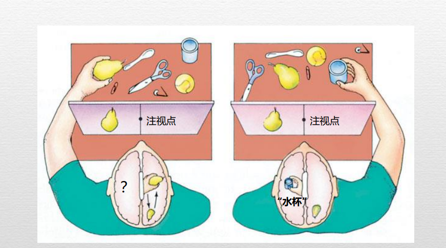

> 当一个裂脑病人用左手去寻找与快速闪现在左视野的图片相匹配的物体时，他可以成功做到，因为他的视觉信息和触觉信息都进入到右半球
>
> 病人不能说出这个物体的名字，因为言语主要是左半球的功能
>
> 
>
> 要求同一个病人用右手完成相同的任务，他不能利用触觉成功地找出物体，因为视觉信息和触觉信息是在不同的半球加工的
>
> 病人可以说出物体的名字

内分泌系统：辅助神经系统的工作（分泌激素到血液中）

激素协助调节生长、第一性征和第二性征的发育，以及协助调节代谢、消化和唤醒水平。

下丘脑：内分泌系统与中枢神经系统间的中转站

- 脑垂体：（通常被称为“主腺体”）产生约10种影响其他分泌腺分泌的激素，以及一种影响生长的激素
  - 促性腺激素=》睾酮：精子的产生，提高攻击欲和性欲
  - 。。。=》雌激素：促使女性的卵巢释放卵子，使其具有生育力

神经发生：自然产生的干细胞发育成新的脑细胞

可塑性：新的细胞生长和生活经验能够在出生之后重塑大脑

## 第四章 感觉与知觉

### 关于世界的感觉知识

- 知觉
  - 定义：理解环境中客体和事件的所有过程——感觉它们，理解它们，识别和标记它们，以及准备对它们作出反应
  - 功能：生存和感官享受
- 知觉的三个阶段
  - 感觉：感受器受到刺激后产生神经冲动以反映身体内外经验的过程
  - 知觉组织：大脑整合来自感官的证据以及对世界的已有知识，形成对外部刺激的内在表征；通常在没有意识觉知的情况下迅速而有效地完成
  - 辨别和识别：赋予知觉物以定义；辨认问题（这个客体是什么？）识别问题（这个客体是干什么用的？）
- 远距刺激：环境中的物理客体
- 近距刺激：客体在视网膜上的光学成像
- 知觉任务：从近距刺激辨认远距刺激

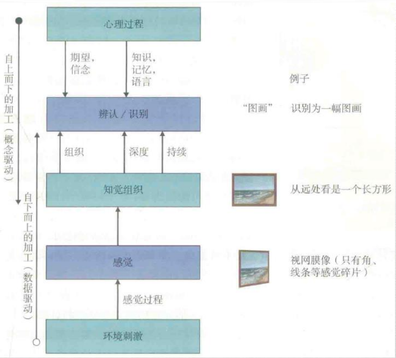

心理物理学：研究物理刺激与其引发的行为或心理体验之间的关系

- 绝对阈限：产生感觉体验所需的最小物理刺激量
  - 测量方法：刺激以不同的强度呈现，每一试次观察者都要回答是否觉察到刺激
  - 操作性定义：在一半的测试中能够觉察到感觉信号存在的刺激水平

- 心理测量函数
  - 在每一种刺激强度（横坐标）下刺激被觉察到的百分数（纵坐标）的曲线
  - 通常是S型曲线
    - 观察者在每次刺激觉察过程中会发生微小变化（由于注意、疲劳等）
    - 观察者有时没有觉察到刺激也会进行反应
    - 

感觉适应：感觉系统对持续的刺激输入反应逐渐减弱的现象；更快速地对新信息源的挑战产生注意和作出反应

反应偏差：由一些与刺激的感觉特性无关的因素，观察者偏好以特定方式进行反应的系统倾向

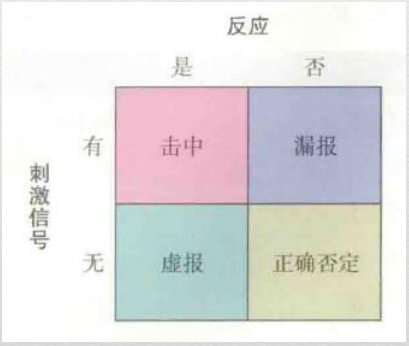

- 信号检测论
  - 解决反应偏差问题的一种系统方法
  - 区分感觉觉察的两个独立的过程
    - 感觉过程：观察者对刺激强度的感受性
    - 决策过程：观察者的反应偏差
- 差别阈限（最小可觉差，JND）
  - 能够识别出的两个不同刺激之间的最小物理差异
  - 测量方法：使用一对刺激，改变这两个刺激间的差异，要求观察者判断两个刺激是否相同
  - 操作性定义：有一半次数觉察出差异的的刺激差值
  - 韦伯定律：刺激之间的最小可觉差与标准刺激强度的比值是恒定的
  - 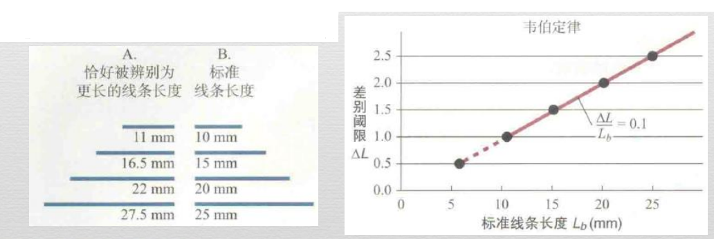
  - 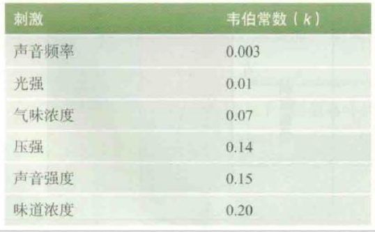

换能：从一种物理能量形式（如光）到另一种形式（如神经冲动）的转换

- 感觉系统的信息传递过程
  - 感受器：把感觉信号的物理形式转换为能够被神经系统加工的细胞信号
  - 神经细胞：整合不同的的感受器单元的信息，提取关于刺激的基本性质的信息
  - 大脑的特定的感觉皮层和联合皮层

### 视觉系统

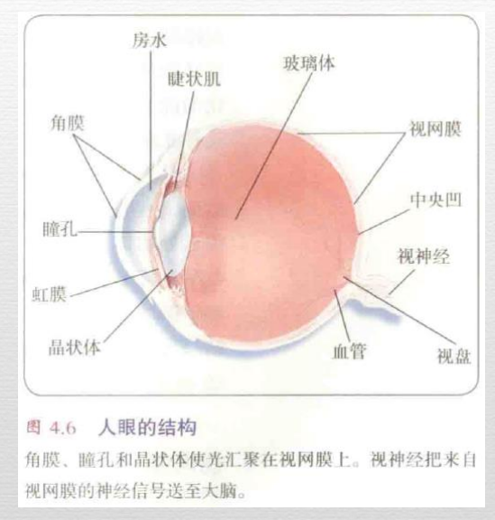

- 瞳孔：光线通过瞳孔进入眼睛（瞳孔大小：控制进入眼球的光线量）
- 晶状体：通过瞳孔的光线进晶状体聚焦到视网膜，使图像左右反转且上下颠倒
- 调节：睫状肌可以改变晶状体的厚度，使近处或者远处的客体聚焦在视网膜上（近视：焦点落在视网膜之前，远视：焦点落在视网膜之后）
- 视网膜
  - 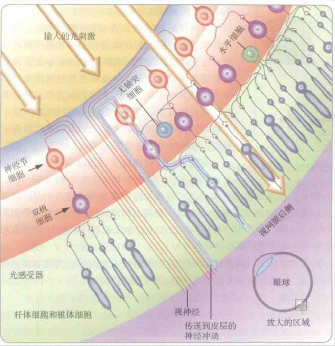
  - 光感受器：锥体细胞和杆体细胞
    - 锥体细胞：在明亮而充满色彩的白天功能最佳
    - 杆体细胞：在近乎黑暗时拥有最佳功能
    - 暗适应：光线条件从光亮转为黑暗后眼睛感受性逐渐提高的过程，其产生是由于在黑暗中停留一段时间后，杆体细胞比锥体细胞变得更敏感，杆体细胞能对环境中微弱的光作出反应
    - 中央凹：只有密布的锥体细胞，对颜色和空间细节在这里被最准确地探测到
    - 双极细胞：整合来自多个感受器的神经冲动，并将结果传递到神经节细胞
    - 神经节细胞：整合来自一个或多个双极细胞的冲动，形成单一的发放频率（纵向连接）；神经节细胞的轴突组成视神经，将眼睛外面的视觉信息传递到大脑
    - 水平细胞&无长突细胞：（横向连接）水平细胞把感受器相互连接起来，无长突细胞则负责双极细胞之间和神经节细胞之间的连接
    - 盲点：（没有感受器）一只眼睛的感受器可以登记另一只眼睛看不到的信息；大脑会用盲点周围区域恰当的感受信息来填充这一区域

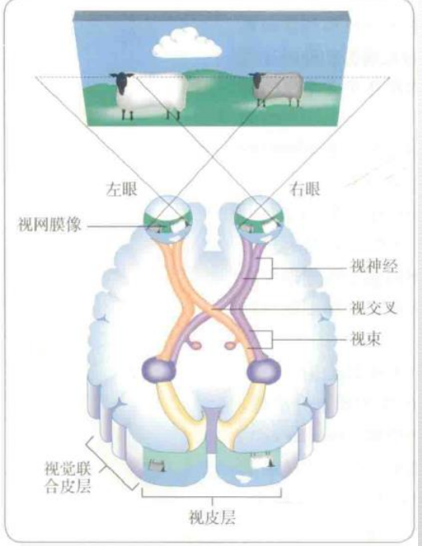

视觉系统的神经通路：视神经、视交叉、视束、外侧膝状体核（丘脑内的一个结构）、初级视觉皮层

视觉分析的两个通路：模式识别（是什么）和位置识别（在哪里）（脑损伤可能影响模式通路或位置通路，或者影响两个通路之间的交流，从而产生一些不同的障碍，统称为失认症）

- 感受野：**一个细胞**的感受野是其输入刺激所对应的视野区域（感受器）
  - 神经节细胞：对特定大小的光斑有最强反应
    - （皮层）简单细胞：对特定朝向的光棒有最强反应
    - （皮层）复杂细胞：对运动着的特定朝向的光棒有最强反应
    - （皮层）超复杂细胞：对运动着的有特定长度或特定运动角度的光棒或者运动中的角或顶点有最强反应
  - 

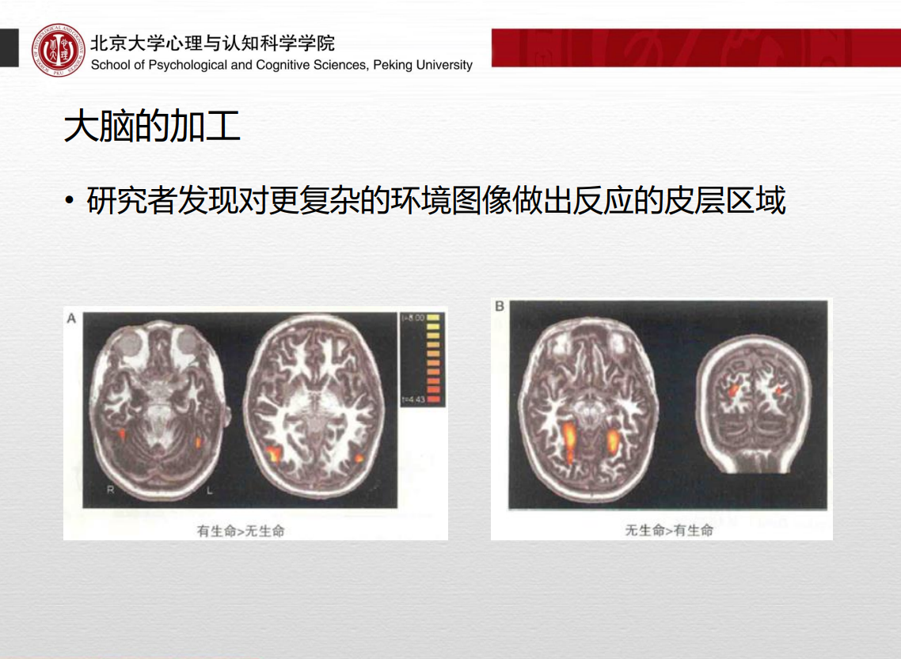

- 颜色视觉
  - 可见光；400 nm - 700 nm
  - 特定物理波长的光线产生特定的颜色体验（三个维度：色调，饱和度，明度）
    - 色调：描述光的颜色的维度
    - 饱和度：描述颜色感觉纯度的维度
    - 明度：描述颜色强度的维度
    - 加法颜色混合（光），减法颜色混合（颜料）
    - 互补色：色环上直接相对的两种波长的光
    - 颜色的视觉后像
    - 色盲：部分或完全不能分辨颜色（红绿色盲（大部分），黄蓝色盲（很少），完全没有颜色体验（最少））
- 三原色理论
  - 三种类型的颜色感受器：红绿蓝
  - 所有的其他的颜色都是由这三种基本感觉相加或相减混合得到的
  - 对应的生理结构：视网膜上存在三种锥体细胞
- 拮抗加工理论
  - 三个基本系统，每个系统包含两种拮抗成分：红绿，蓝黄，黑白
  - 颜色的视觉后像
  - 色盲的颜色类型成对出现
  - 对应的生理结构：一些神经节细胞接受来自红光的兴奋性输入和来自绿光的抑制性输入，而另一些细胞的兴奋和抑制模式是相反的，从而构成红绿拮抗加工系统

### 听觉系统

- 声音的心理维度
  - 音高：声音的高低，由频率决定
  - 响度：声音的强度，由振幅决定
  - 音色：反应了复合声波的成分

四个基本的能量转换：

1. 空气中的声波必须在耳蜗中转换为流体波
2. 流体波必须导致基底膜产生机械振动
3. 振动必须转化为电脉冲
4. 电脉冲必须传入听皮层

- 听觉障碍
  - 传导性耳聋（空气振动传导到耳蜗的过程中出现问题）
  - 神经性耳聋（在耳中产生神经冲动或将神经冲动传导到听皮层的神经机制存在缺陷或听皮层损伤）
- 音高知觉理论
  - 地点说：基底膜发生最大刺激的特定位置（适用于1000Hz以上的音高知觉）
  - 频率说：基底膜振动的频率（适用于5000Hz以下的音高知觉，齐射原理）
- 声音定位
  - 两耳时间差
  - 两耳强度差

### 其他感觉

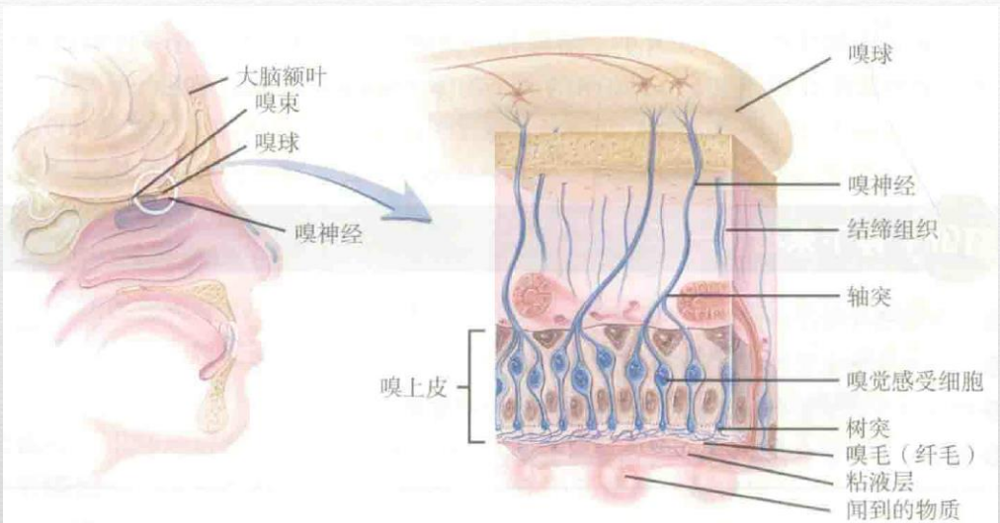

- 嗅觉
  - 发现和定位食物
  - 探测潜在的危险源
  - 有效的交流形式（信息素）

- 味觉
  - 五种基本味道：酸甜苦咸鲜
  - 单个味觉感受细胞对五种基本感觉味道中的某一种反应最为强烈
  - 分辨食物的味道主要依靠嗅觉而非味觉
- 触觉和肤觉
  - 压力
    - 众多类型的感受器细胞
      - 迈斯纳小体：摩擦皮肤
      - 梅克尔触盘：小物体对皮肤施加的持续的压力
    - 压力敏感性在身体不同部位的差异非常大
      - 指尖>后背皮肤
  - 温度
    - 冷传感纤维和暖传感纤维
  - 触摸
    - 性感区

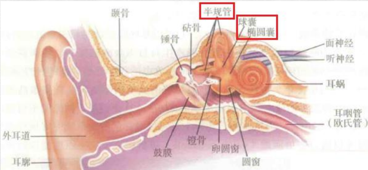

- 前庭觉
  - 身体--特别是头部--是如何根绝重力确定朝向的
  - 感受器：位于内耳中充满液体的导管和囊中的小纤毛
  - 晕动现象：来自视觉系统和前庭系统的信息相互冲突时产生
  - 球囊和椭圆囊：直线上加速和减速；半规管：任何方向的运动信息
- 动觉
  - 提供运动过程中关于身体状态的感觉反馈
  - 感受器：位于关节中的感受器和位于肌肉和肌腱中的感受器
  - 动觉和触觉信息的整合
- 痛觉
  - 身体对有害刺激（强度足够导致组织损伤或具有这种威胁性的刺激）的反应，是重要的防御信号
  - 感受器：只对特定疼痛刺激（温度，化学物质，机械刺激）起反应的感受器、对痛觉刺激的组合起反应的感受器
  - 神经通路：脊髓 -》丘脑-》 大脑皮层
  - 内啡肽： 影响痛觉体验
  - 门控理论：脊髓中的细胞像神经闸门一样，切断和阻止一些痛觉信号进入大脑，而允许其他信号进入。大脑和皮肤中的感受器向脊髓发送开门和关门的信息
  - 神经矩阵理论：人们常常经历一些没有物理起因的疼痛，在这种情况下，疼痛完全源于大脑

### 知觉的组织过程

- 注意过程
  - 将意识觉知指向所有能获得的信息中的一个子集
  - 目标指向选择：你对将要注意的客体做出的选择，与你自己的目标有关
  - 刺激驱动捕获：刺激的特征--环境中的客体--自动抓住你的主意，不依赖于知觉者当时的目标
  - 至少在某些情况下，刺激驱动会胜过目标指向选择
- 知觉组织原则
  - 图形与背景：知觉组织的第一步是将场景中的一部分解读为突出于背景的物体
  - 格式塔心理学
    - 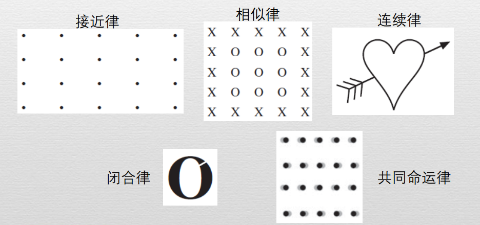
    - 最接近的元素组织在一起
    - 最相似的元素组织在一起
    - 即使线条被截断，人们也会将其知觉为连续的
    - 填补小的空隙而将客体知觉为一个整体
    - 似乎在向同一方向运动的客体组织起来

- 空间和时间上的整合
  - 边界扩展
  - 变化盲视
- 运动知觉
  - 对外部世界的不同扫视进行比较
  - $\phi$现象
    - 当视野不同位置的两个静止光点以大约每秒4到5次的频率交替出现时，我们会知觉到单个光点在两个位置之间来回移动
  - 有助于将视觉系统中的元素拼凑在一起

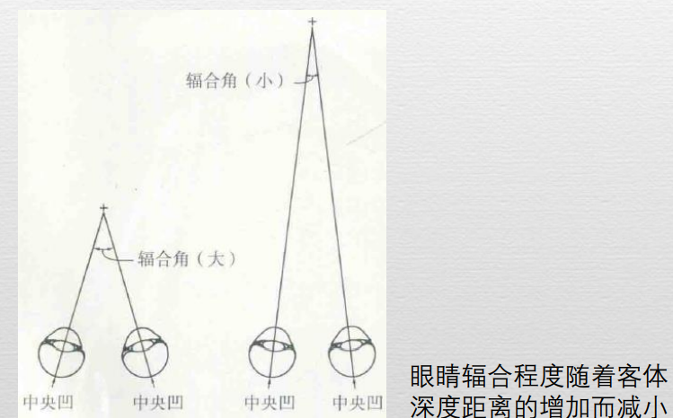

- 深度知觉
  - 双眼深度线索
    - 视网膜像差（一个客体对应于双眼的图像在水平方向上的位移）：视网膜像差随着两个客体之间的深度距离的增加而增大
    - 视轴辐合（当两只眼睛注视同一个客体时，它们就会在某种程度上向内测转动）：眼睛辐合程度随着客体深度距离的增加而减少（up to 3m）
  - 运动线索
    - 运动视差（当个体运动时，环境中客体的相对距离决定了它们在视网膜影像上相对运动的大小和方向）
    - 运动视差随着客体深度距离的增加而减少
  - 单眼视觉
    - 插入或遮挡：近处的物体遮挡远处的物体
    - 相对大小：近处的物体在视网膜上投射的像更大
    - 线条透视：当平行线向远处延伸时，它们在视网膜成像中在地平线上汇聚为一个点
    - 质地梯度：随着表面向深处延伸，质地的密度变大

- 知觉恒常性
  - 尽管感受器接受的刺激在改变，但个体所知觉到的世界是不变的、恒常的、稳定的。
  - 大小恒常性：在视网膜成像大小变化的情况下感知客体真实大小的能力（依赖对深度的知觉和关于相似形状物体典型大小的先验知识）
  - 形状恒常性：即便当客体处于倾斜的位置，使得视网膜成像的形状本质上不同于客体本身的形状时，个体仍然能够正确地感知客体的真实形状（依赖于对深度的知觉）
  - 亮度恒常性：人们在不同的照明条件下，将物体的白度，灰度和黑度知觉为特定的倾向（依赖于对物体反射光线占入射光线百分比的知觉）
- 错觉
  - 当使用一种被证明是错误的方式体验某种刺激模式时，个体会体验到错觉
  - 由于人们的感觉系统具有相同的生理基础和人们对世界的经验相似，大多数人在相同知觉情形中会有同样的错觉

### 辨认和识别过程

- 自下而上的加工（数据驱动）
  - 以经验事实为基础，处理零散的信息，并将外界刺激的具体物理特征转换为抽象表征
- 自上而下的加工（概念驱动，假设驱动）
  - 涉及过去的经验、知识、动机和文化背景等（记忆中存储的概念会影响对感觉数据的解释）

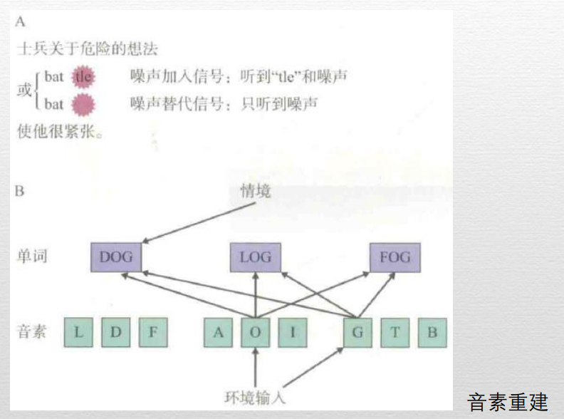

音素重建：噪音掩盖了物理信号，但人们却很少意识到他们听到的声音信号有间断

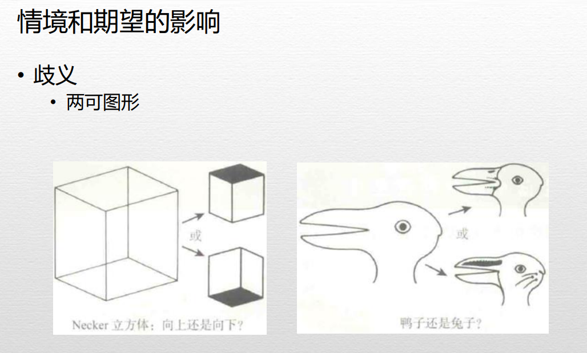

歧义：单一的图像有多种解释（来回翻转）

歧义的解决：利用情景信息和先前的期望

- 定势
  - 一种暂时的准备状态，使个体以某种特定的方式对一个刺激产生知觉或反应
  - 运动定势：个体做出预设的快速反应的准备状态（枪声：跑）
  - 心理定势：个体根据习得的规则、说明、期望或习惯倾向来应对某种情境的准备状态（可能妨碍解决问题）
  - 知觉定势：在既定情境中知觉到特定刺激的准备状态（母亲：孩子的哭声）

